# Data: Liberating data with WebPlotDigitizer

*Purpose*: Sometimes data are messy---we know how to deal with that. Other times data are "locked up" in a format we can't easily analyze, such as in an image. In this exercise you'll learn how to *liberate* data from a plot using WebPlotDigitizer.

*Reading*: (*None*, this exercise *is* the reading.)

*Optional Reading*: [WebPlotDigitizer tutorial video](https://youtu.be/P7GbGdMvopU) ~ 19 minutes. (I recommend you give this a watch if you want some inspiration on other use cases: There are a lot of very clever ways to use this tool!)


```r
library(tidyverse)
```

```
## ── Attaching packages ─────────────────────────────────────── tidyverse 1.3.0 ──
```

```
## ✔ ggplot2 3.4.0      ✔ purrr   1.0.1 
## ✔ tibble  3.1.8      ✔ dplyr   1.0.10
## ✔ tidyr   1.2.1      ✔ stringr 1.5.0 
## ✔ readr   2.1.3      ✔ forcats 0.5.2
```

```
## ── Conflicts ────────────────────────────────────────── tidyverse_conflicts() ──
## ✖ dplyr::filter() masks stats::filter()
## ✖ dplyr::lag()    masks stats::lag()
```

*Background*: [WebPlotDigitizer](https://automeris.io/WebPlotDigitizer/) is one of those tools that is *insanely useful*, but *no one ever teaches*. I didn't learn about this until six years into graduate school. You're going to learn some very practical skills in this exercise!

*Note*: I originally extracted these data from an [Economist](https://www.economist.com/graphic-detail/2020/05/13/the-spread-of-covid-has-caused-a-surge-in-american-meat-prices) article on American meat prices and production in 2020.

## Setup

### __q1__ Get WebPlotDigitizer.

Go to the [WebPlotDigitizer](https://automeris.io/WebPlotDigitizer/) website and download the desktop version (matching your operating system).

*Note*: On Mac OS X you may have to open `Security & Privacy` in order to launch WebPlotDigitizer on your machine.

## Extract

### __q2__ Extract the data from the following image:

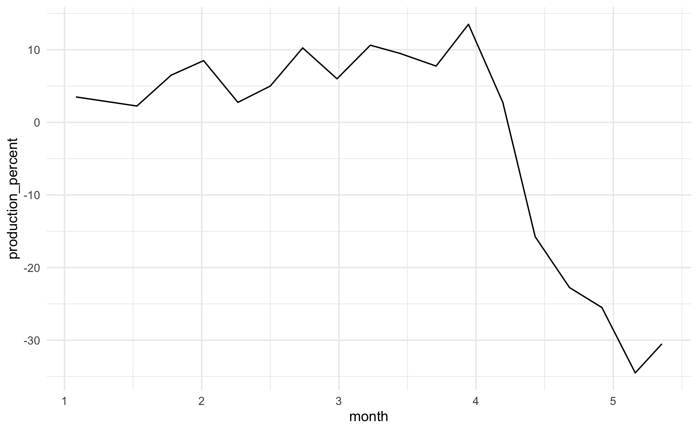

This image shows the percent change in US beef production as reported in this [Economist](https://www.economist.com/graphic-detail/2020/05/13/the-spread-of-covid-has-caused-a-surge-in-american-meat-prices) article. We'll go through extraction step-by-step:

1. Click the `Load Image(s)` button, and select `./images/beef_production.png`.

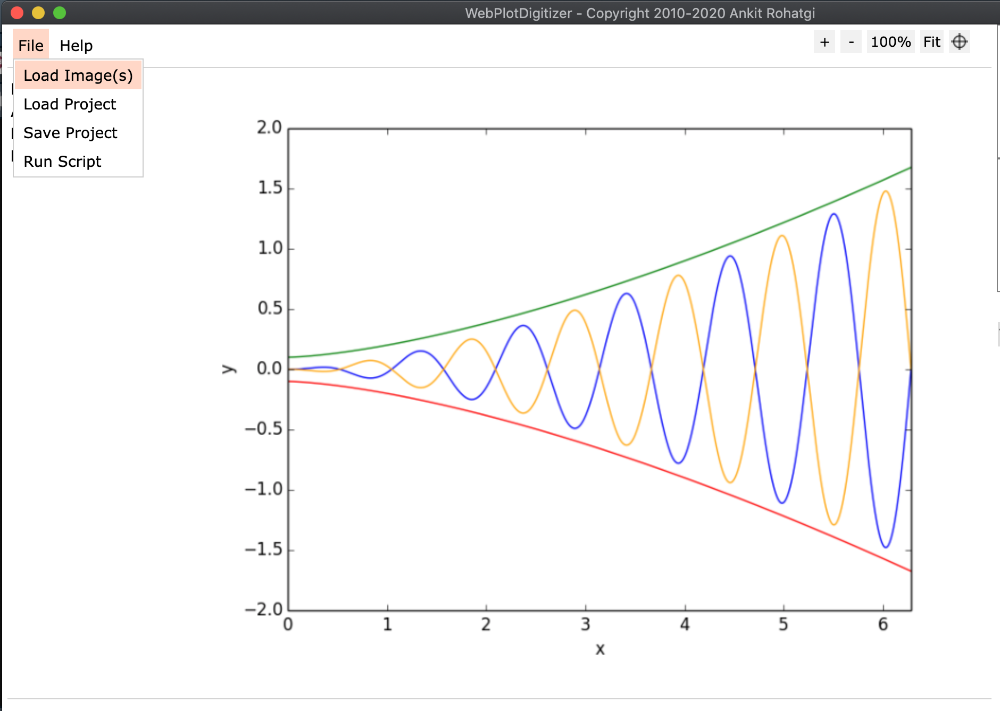
2. Choose the `2D (X-Y) Plot` type.

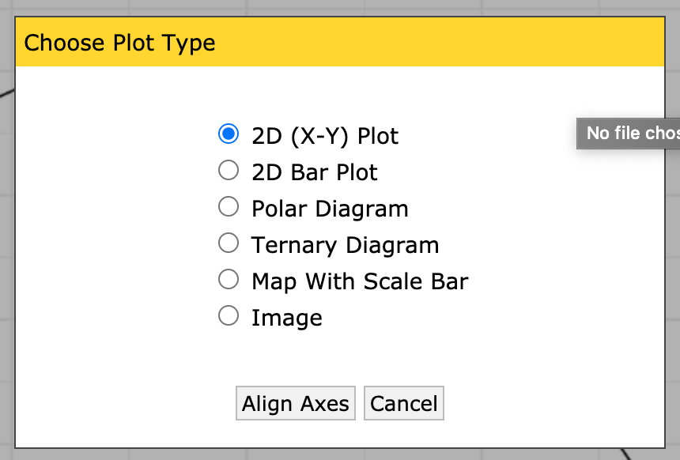
3. Make sure to *read these instructions*!

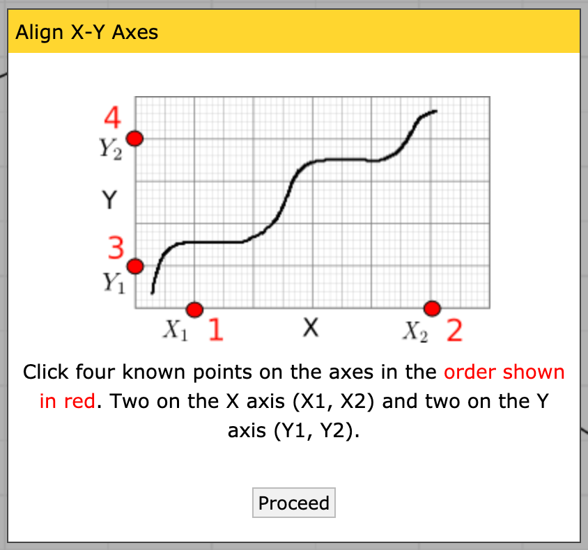
4. Place the four control points; it doesn't matter what *precise* values you pick, just that you know the X values for the first two, and the Y values for the second two.

*Note*: Once you've placed a single point, you can use the arrow keys on your keyboard to make *micro adjustments* to the point; this means *you don't have to be super-accurate* with your mouse. Use this to your advantage!

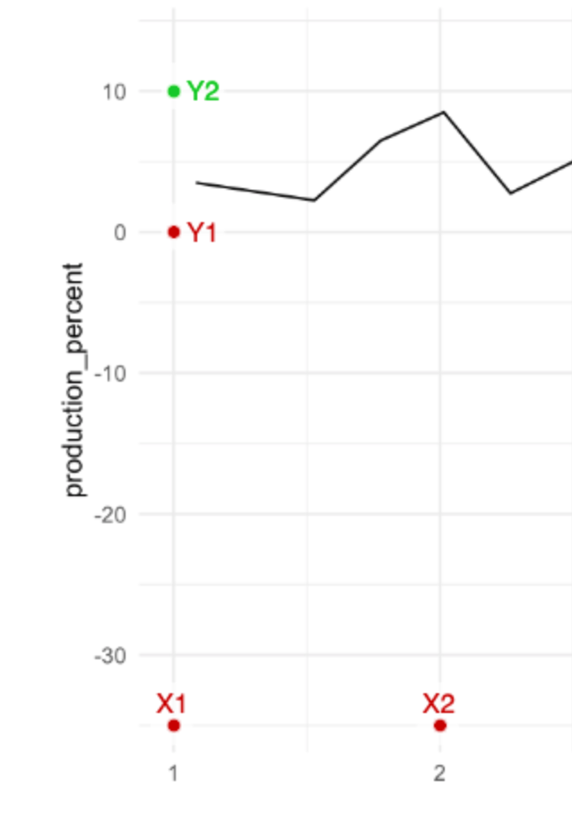
5. *Calibrate* the axes by entering the X and Y values you placed. Note that you can give decimals, dates, times, or exponents.

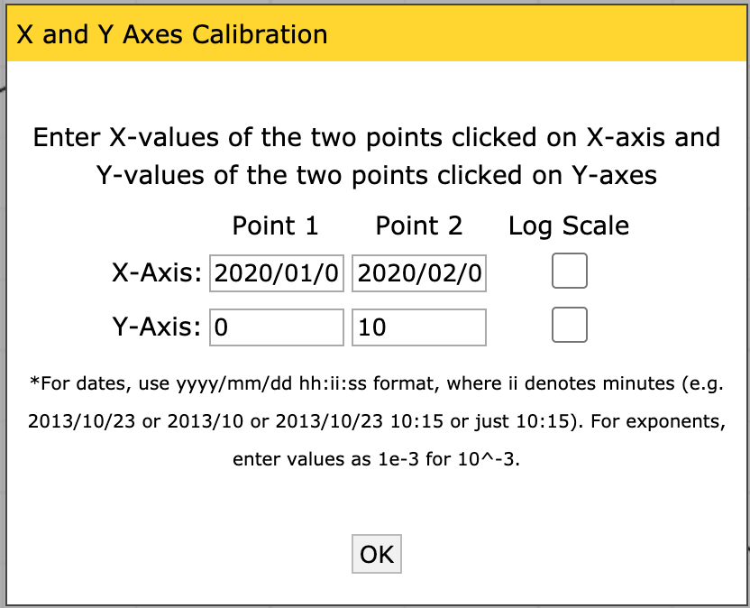
6. Now that you have a set of axes, you can *extract* the data. This plot is fairly high-contrast, so we can use the *Automatic Extraction* tools. Click on the `Box` setting, and select the foreground color to match the color of the data curve (in this case, black).

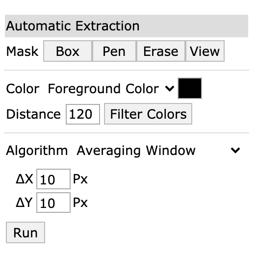

7. Once you've selected the box tool, draw a rectangle over an area containing the data. Note that if you cover the labels, the algorithm will try to extract those too!

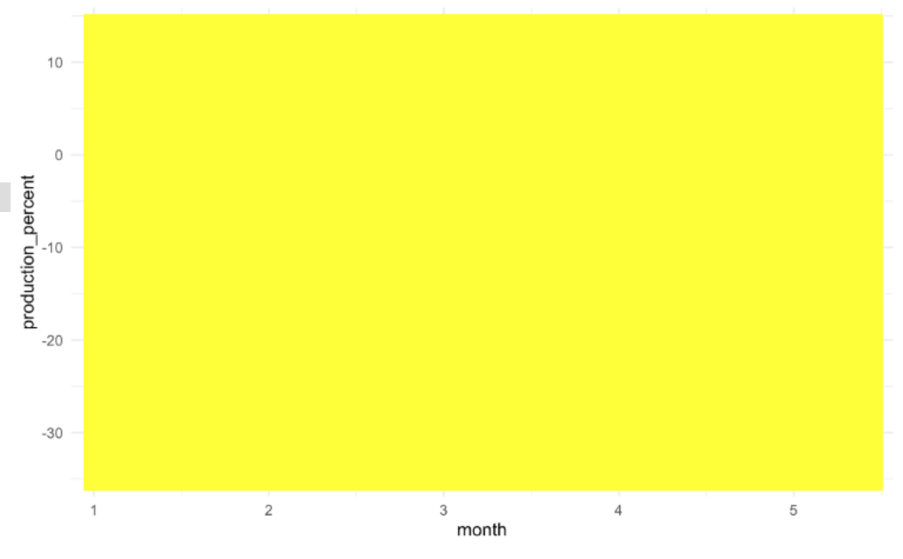
8. Click the `Run` button; you should see red dots covering the data curve.

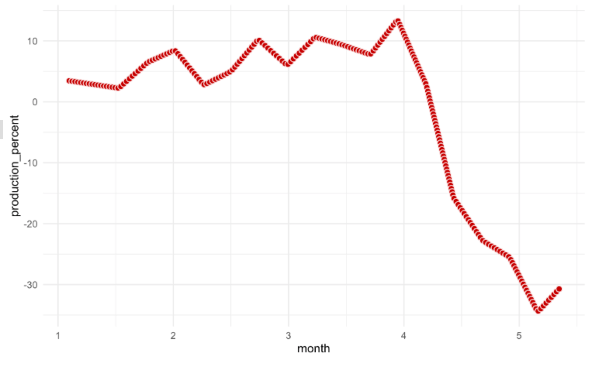

9. Now you can save the data to a file; make sure the dataset is selected (highlighted in orange) and click the `View Data` button.

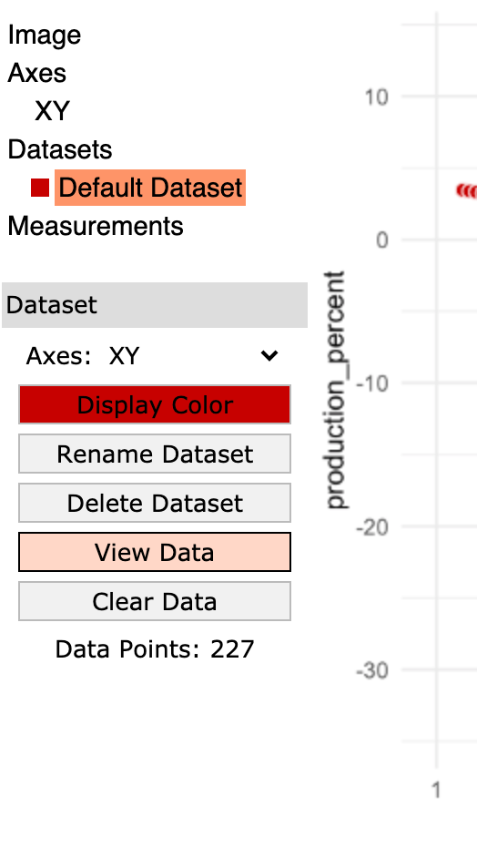
10. Click the `Download .CSV` button and give the file a sensible name.

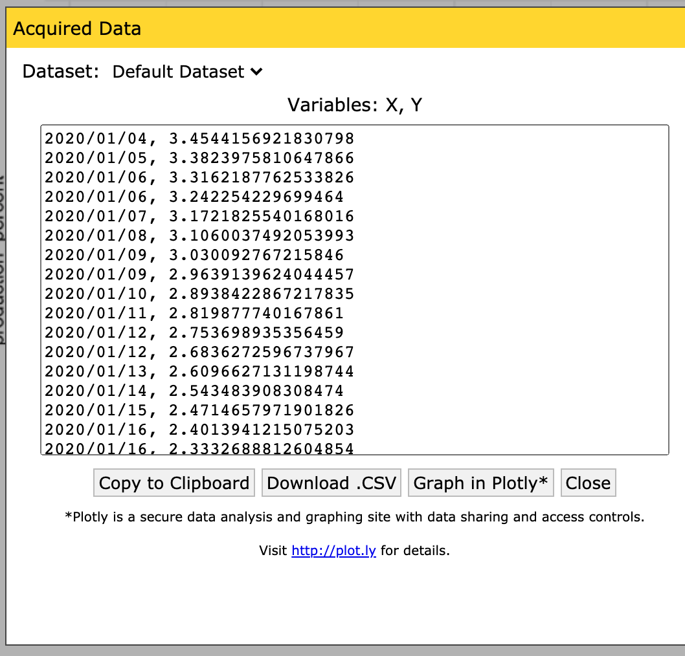
Congrats! You just *liberated* data from a plot!

### __q3__ Extract the data from the following plot. This will give you price data to compare against the production data.

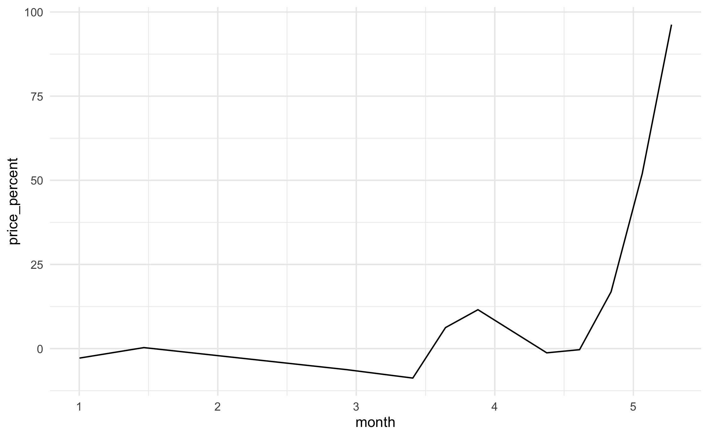

## Use the extracted data

### __q4__ Load the price and production datasets you extracted. Join and plot price vs production; what kind of relationship do you see?


```r
## NOTE: Your filenames may vary!
df_price <- read_csv(
  "./data/beef_price.csv",
  col_names = c("date", "price_percent")
)
```

```
## Rows: 232 Columns: 2
## ── Column specification ────────────────────────────────────────────────────────
## Delimiter: ","
## dbl  (1): price_percent
## date (1): date
## 
## ℹ Use `spec()` to retrieve the full column specification for this data.
## ℹ Specify the column types or set `show_col_types = FALSE` to quiet this message.
```

```r
df_production <- read_csv(
  "./data/beef_production.csv",
  col_names = c("date", "production_percent")
)
```

```
## Rows: 227 Columns: 2
## ── Column specification ────────────────────────────────────────────────────────
## Delimiter: ","
## dbl  (1): production_percent
## date (1): date
## 
## ℹ Use `spec()` to retrieve the full column specification for this data.
## ℹ Specify the column types or set `show_col_types = FALSE` to quiet this message.
```

```r
## NOTE: I'm relying on WebPlotDigitizer to produce dates in order to
## make this join work. This will probably fail if you have numbers
## rather than dates.
df_both <-
  inner_join(
    df_price,
    df_production,
    by = "date"
  )

df_both %>%
  ggplot(aes(production_percent, price_percent, color = date)) +
  geom_point()
```


**Observations**:

- In the middle of the pandemic beef production dropped quickly without a large change in price.
- After production dropped by 20% beef price began to spike.
- As the pandemic continued in the US, beef production increased slightly, but price continued to rise.

<!-- include-exit-ticket -->
