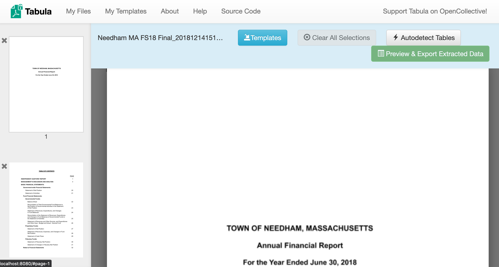
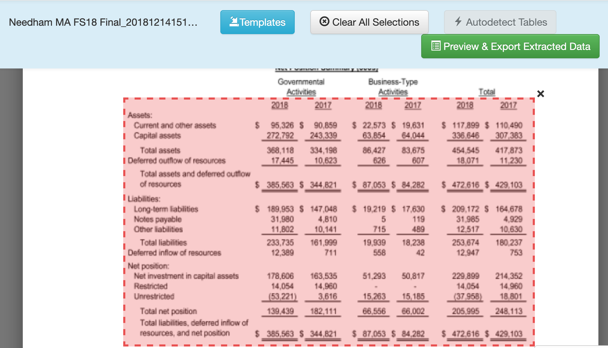
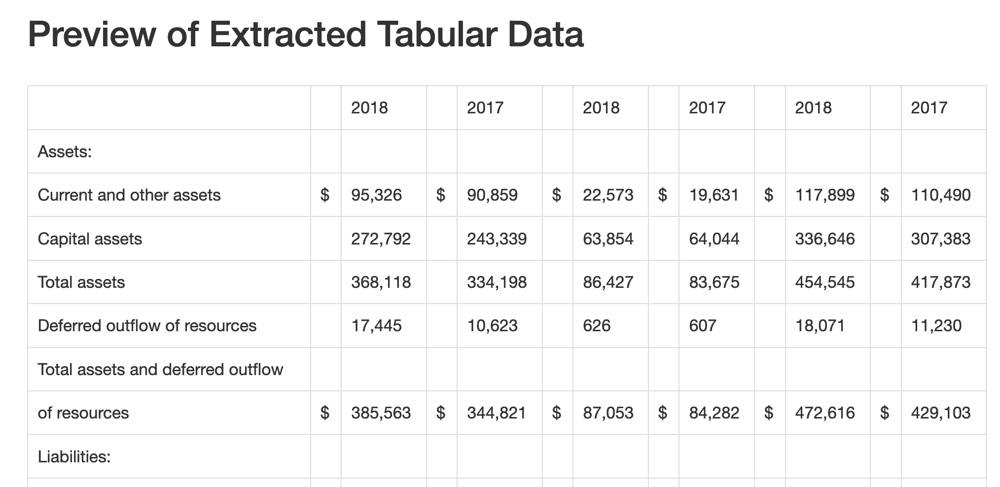

# Data: Liberating data with Tabula

*Purpose*: Sometimes data are messy---we know how to deal with that. Other times data are "locked up" in a format we can't easily analyze, such as in a PDF. In this exercise you'll learn how to *liberate* data from a PDF table using Tabula.

*Reading*: (*None*, this exercise *is* the reading.)


```r
library(tidyverse)
```

```
## ── Attaching packages ─────────────────────────────────────── tidyverse 1.3.1 ──
```

```
## ✔ ggplot2 3.3.5     ✔ purrr   0.3.4
## ✔ tibble  3.1.2     ✔ dplyr   1.0.7
## ✔ tidyr   1.1.3     ✔ stringr 1.4.0
## ✔ readr   1.4.0     ✔ forcats 0.5.1
```

```
## ── Conflicts ────────────────────────────────────────── tidyverse_conflicts() ──
## ✖ dplyr::filter() masks stats::filter()
## ✖ dplyr::lag()    masks stats::lag()
```

*Background*: [Tabula](https://tabula.technology/) is a piece of software developed for journalists carrying out investigative reporting. It was developed with support from organizations like [ProPublica](http://propublica.org/) and [The New York Times](http://www.nytimes.com/). This tool is meant to help investigators parse unwieldy PDFs and liberate useful information.

## Setup

### __q1__ Install Tabula.

Download and install [Tabula](https://tabula.technology/); the webpage has installation instructions.

*Note*: Tabula's interface is through a locally-hosted server; it should automatically open a browser window for Tabula. If it does not, then open [http://localhost:8080/](http://localhost:8080/) after you've launched Tabula.

## Liberating Data

### __q2.1__ Obtain the data.

Download `FY2019 independent financial audit report (PDF)` from the Needham, MA [financial reports page](https://www.needhamma.gov/1673/Financial-Reports).

### __q2.2__ Try it the hard way.

Try copy-pasting from the FY2019 report the table `Government-Wide Financial Analysis` into a text document or your favorite spreadsheet editor. **This is unlikely to produce the desired result.** (Please don't spend any time trying to format this copied data---you're about to learn a better way!)

Tabula is a tool that will help us *liberate* the data; basically, it's a copy-paste for PDF tables *that actually works*.

### __q3__ Extract from the FY2019 report the `Government-Wide Financial Analysis` table.

We'll do this in steps:

1. Click the browse button to select your downloaded FY2019 report and click *Import*.


2. Wait for the file to finish processing; this takes about 2 minutes on my laptop.


3. Once Tabula has imported the file, your view will switch to a view of the PDF.



4. Scroll to the `Government-Wide Financial Analysis` table; click and drag to select the data. Click *Preview & Export Extracted Data*.



5. You will arrive at a preview of the extracted data. You may find that Tabula has merged some of the columns; if this happens click the *Revise selection(s)* button to go back and adjust your selection.



6. Once you have a preview that matches the columns above, select the CSV filetype and click the *Export* button. Download the file to your `data` folder and give it a sensible filename.

### __q4__ Load and clean the data.

Load and clean the table you extracted above. Use the column names `category` and `[government|business|total]_[2019|2018]`. Do not *tidy* (pivot) the data yet, but make sure the appropriate columns are numeric.

*Note*: In accounting practice, numbers in parentheses are understood to be negative, e.g. `(1000) = -1000`.


```r
df_2019_raw <- read_csv(
  "./data/needham_fs19.csv",
  skip = 1,
  col_names = c(
    "category",
    "X2",
    "governmental_2019",
    "X4",
    "governmental_2018",
    "X6",
    "business_2019",
    "X8",
    "business_2018",
    "X10",
    "total_2019",
    "X12",
    "total_2018"
  )
)

df_2019 <-
  df_2019_raw %>%
  select(-contains("X")) %>%
  ## across() allows us to apply the same mutation to multiple
  ## columns; remove all internal spaces from numbers
  mutate(across(-category, ~str_remove_all(., "\\s"))) %>%
  ## Handle numbers enclosed by parentheses; make them negative
  ## and remove all parentheses for the number parser
  mutate(across(
    -category,
    ~if_else(
      str_detect(., "\\("),
      str_c("-", str_remove_all(., "[\\(\\)]")),
      str_remove_all(., "[\\(\\)]")
    )
  )) %>%
  ## Use the number parser to handle conversions
  mutate(across(-category, parse_number)) %>%
  ## Fix a couple chopped lines
  mutate(
    category = if_else(
      category == "resources",
      "Total assets and deferred outflow of resources",
      category
    )
  ) %>%
  mutate(
    category = str_replace(
      category,
      "resources, and net position",
      "Total liabilities, deferred inflow of resources, and net position"
    )
  ) %>%
  filter(!is.na(governmental_2019))
df_2019 %>% glimpse()
```

Use the following to check your work:


```r
## NOTE: No need to edit; check a couple problematic values
assertthat::assert_that(
  (
    df_2019 %>%
    filter(category == "Deferred outflow of resources") %>%
    pull(business_2019)
  ) == 1160
)

assertthat::assert_that(
  (
    df_2019 %>%
    filter(category == "Unrestricted") %>%
    pull(governmental_2019)
  ) == -62396
)

print("Excellent!")
```

Where Tabula really shines is in cases where you need to process *many* documents; if you find yourself needing to process a whole folder of PDF's, consider using Tabula.

<!-- include-exit-ticket -->
