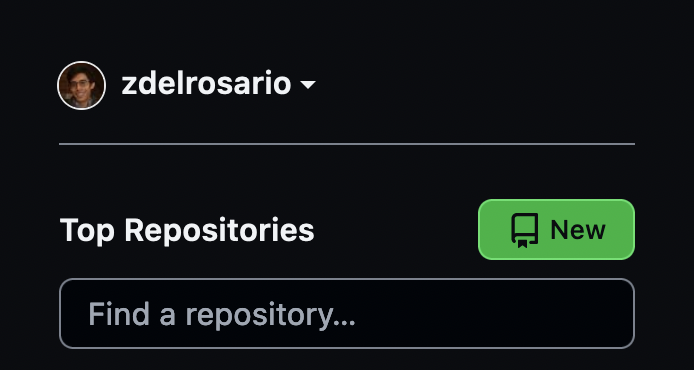
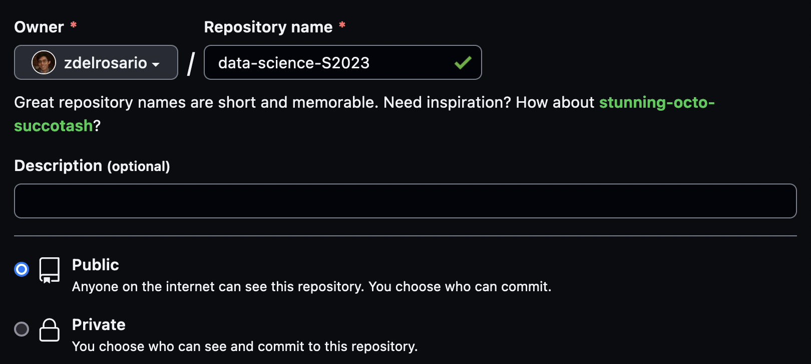
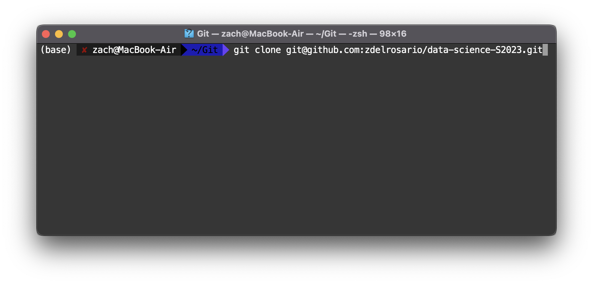
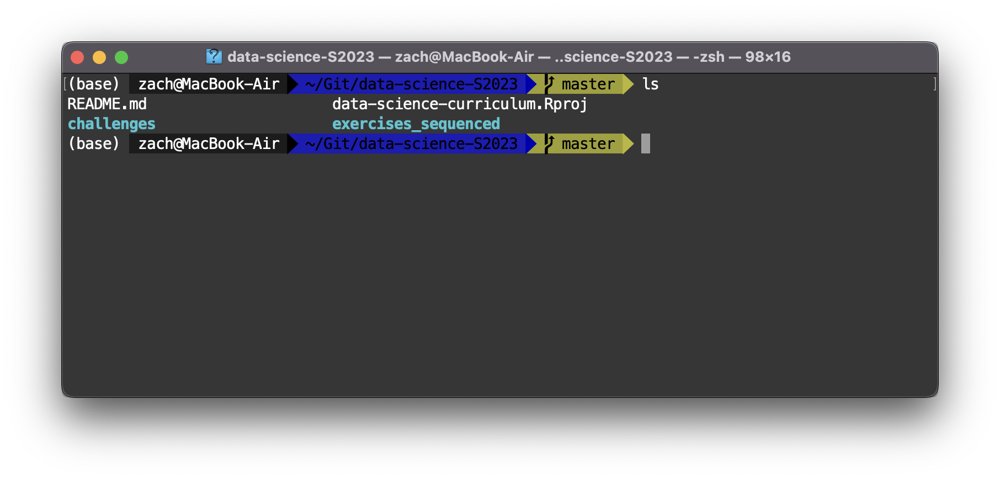

Reproducibility: Git and Our Curriculum
================
Zachary del Rosario
2020-06-24

# Reproducibility: Git and Our Curriculum

*Purpose*: Git is a powerful tool to manage our work, but it can be
confusing at first. Here we will read some introductory materials about
Git, and use the software to download and set up the exercises for the
course.

*Reading*: [Automated Version
Control](https://swcarpentry.github.io/git-novice/01-basics/index.html),
complete the steps in [Setting Up
Git](https://swcarpentry.github.io/git-novice/02-setup/index.html)

*Note*: For the steps in the reading, I recommend using the Terminal in
RStudio. This should help ensure you have access to Git.

*Topics*: version control, git setup, working with our exercises, ssh
keys

*Note*: If you’re reading this file in RStudio, you can Shift + Click
(CMD + Click) to follow a link.

## Windows-specific Instructions

<!-- -------------------------------------------------- -->

If you are on a Windows computer, you will need to complete some
additional steps. Please follow [these
instructions](https://github.com/zdelrosario/data-science-curriculum/blob/master/exercises/e-windows-gitbash.md)
before continuing.

## Set Up SSH Key

<!-- -------------------------------------------------- -->

Before you can “clone” (download) the repository of exercises, you’ll
need to set up `ssh` with GitHub. Follow these instructions to [add an
SSH
key](https://help.github.com/en/github/authenticating-to-github/adding-a-new-ssh-key-to-your-github-account)
to your account. This will allow you to work with GitHub without typing
in your password.

*Note*: This can be a bit confusing if you’ve never worked with SSH
before; *please do ask questions* if you are stuck!

## Downloading Our Exercises

<!-- -------------------------------------------------- -->

Open your browser and log into GitHub. Click the `New` button to create
a new repository.

Give this a sensible name, like `data-science-S2023`. **Ensure your
repository is public,** or you will not be able to submit your homework!

Once you’ve selected the correct settings, click `Create Repository`.
This creates a repository on GitHub’s servers, but you still need to
download it locally. After creating your repository, you’ll see the
following link in your browser. Copy the SSH link (note, **not** the
HTTPS link) and open a Terminal.

Navigate in your terminal to the location where you’d like to store your
work for this class. Type the command `git clone` and paste the link you
copied above. Hit Return to “clone” a local copy of your repository. Git
will likely tell you that you cloned an empty repository. That’s OK!
We’re going to add the course materials next.

*Note*: If you haven’t used a Terminal before, just open RStudio and
find the Terminal tab (towards the bottom).

Download the curriculum as a zip file from [this
link](https://github.com/zdelrosario/data-science-curriculum/archive/refs/heads/build.zip).
Unzip this in your blank repository. Unzip the materials and copy them
to your (empty) repository. Once you’ve done this, your repository
folder should look like this:

Once you’ve copied over the materials, run the three following commands
from your Terminal while inside your repository:

`git add *`

`git commit -m "initial commit"`

`git push`

If you do this successfully, you can refresh the repository page in your
browser and see the following:

Once you’ve gotten to this point, take a moment to look around the
repository. The `exercises_sequenced` folder contains all of the
Exercises for the course, while the `challenges` folder contains all of
the challenges you will complete as your homework. You will commit your
work to this repository then submit links on Canvas.

*Aside*: Note that *Git* and *GitHub* are two different things! *Git* is
a version control tool, while *GitHub* is a service that uses Git where
you can host repositories. For instance,
[GitLab](https://about.gitlab.com/) is another service where you can
host Git repositories.

<!-- include-exit-ticket -->
